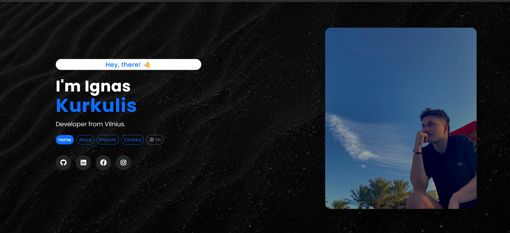

# Portfolio Projekto Dokumentacija - Ignas Kurkulis



## Apžvalga

Tai yra portfolio svetainė, sukurta su React ir TypeScript frontend'ui, bei Node.js/Express backend'ui. Portfolio demonstruoja profesionalų darbą, įgūdžius ir suteikia kontaktų sistemą. Projektas apima adaptyvų dizainą su Bootstrap, pasirinktinį stilių su SASS ir patikimą backend API kontaktų formoms bei kitam dinamiškam turiniui valdyti.

Svetainė šiuo metu yra įdiegta ir veikia kurkulis.lt domene. Projekto frontend dalis yra hostinama Hostinger platformoje. Tuo tarpu backend dalis, kuri apdoroja kontaktų formos užklausas ir siunčia el. laiškus, yra talpinama Railway.app debesų paslaugoje.

# Projekto Struktūra ir Aprašymas

## Struktūra:

```
Portfolio/
├── server/
│   ├── models/
│   │   └── messagesModels.js
│   ├── routes/
│   │   └── messagesRoutes.js
│   ├── utils/
│   │   └── emailService.js
│   ├── .env
│   ├── .env.example
│   ├── .gitignore
│   ├── package.json
│   ├── package-lock.json
│   └── server.js
├── front-end/
│   ├── public/
│   │   ├── data/
│   │   │   ├── data_en.json
│   │   │   ├── data_lt.json
│   │   ├── favicon/
│   │   ├── About/
│   │   ├── Home/
│   │   ├── Project/
│   ├── src/
│   │   ├── components/
│   │   │   ├── NavBar/
│   │   │   │   └──NavBar.tsx
│   │   │   └── LoadingSpinner.tsx
│   │   ├── pages/
│   │   │   ├── Home/
│   │   │   │   └──  home.tsx
│   │   │   ├── AboutMe/
│   │   │   │   └──  aboutMe.tsx
│   │   │   ├── Projects/
│   │   │   │   └──  projects.tsx
│   │   │   └── Contact/
│   │   │       └── contact.tsx
│   │   ├── contexts/
│   │   │   └──LanguageContext.tsx
│   │   ├── hooks/
│   │   │   └──useIntersectionObserver.ts
│   │   ├── types/
│   │   │   └── types.ts
│   │   ├── assets/
│   │   ├── sass/
│   │   │   ├── Home/
│   │   │   │   ├── home.scss
│   │   │   │   └── home-responsive.scss
│   │   │   ├── AboutMe/
│   │   │   │   ├── aboutMe.scss
│   │   │   │   └── aboutMe-responsive.scss
│   │   │   ├── NavBar/
│   │   │   │   └── NavBar.scss
│   │   │   ├── Projects/
│   │   │   │   ├── projects.scss
│   │   │   │   └── projects-responsive.scss
│   │   │   └── Contact/
│   │   │       ├── contact.scss
│   │   │       └── contact-responsive.scss
│   │   ├── tests/
│   │   │    ├── AboutMe.test.tsx
│   │   │    ├── App.test.tsx
│   │   │    ├── contactForm.test.tsx
│   │   │    ├── Home.test.tsx
│   │   │    ├── NavBar.test.tsx
│   │   │    └── Projects.test.tsx
│   │   ├── App.tsx
│   │   ├── main.tsx
│   │   ├── index.css
│   │   └── vite-env.d.ts
│   ├── .env
│   ├── .env.example
│   ├── .gitignore
│   ├── package.json
│   ├── package-lock.json
│   ├── vite.config.ts
│   ├── tsconfig.json
│   ├── tsconfig.node.json
│   ├── tsconfig.app.json
│   ├── eslint.config.js
│   └── index.html
└── README.md
```


# Aprašymas:

## Serveris (Backend)

    1. models:
        ◦ messagesModels.js: Duomenų struktūrų apibrėžimas kontaktų žinutėms ir portfolio objektams.
    2. routes:
        ◦ messagesRoutes.js: API galutinių taškų apibrėžimas frontend-backend komunikacijai.
    3. utils:
        ◦ emailService.js: El. pašto siuntimo funkcionalumas kontaktų formoms.
    4. .env: Konfigūracijos failas, saugantis jautrius kintamuosius (duomenų bazės prisijungimai, API raktai).
    5. server.js: Pagrindinis serverio failas, kuris paleidžia Express backend.
    6. package.json: Node.js projekto priklausomybės ir skriptai.

## Frontend

    1. public:
        ◦ data: JSON failai su daugiakalbiu turiniu (anglų, lietuvių).
          - data_en.json: Anglų kalbos turinys
          - data_lt.json: Lietuvių kalbos turinys
        ◦ favicon: Pilna favicon kolekcija skirtingoms platformoms ir dydžiams.
        ◦ About: Statiniai ištekliai apie puslapio skilčiai.
        ◦ Home: Statiniai ištekliai namų puslapio skilčiai.
        ◦ Project: Statiniai ištekliai projektų puslapio skilčiai.
    2. src:
        ◦ components: 
          - NavBar: Navigacijos komponentas su adaptyviuoju dizainu (NavBar.tsx).
          - LoadingSpinner: Užkrovimo būsenos komponentas (LoadingSpinner.tsx).
        ◦ pages: 
          - Home: Pagrindinis puslapio skiltis (home.tsx).
          - AboutMe: Asmeninės informacijos puslapio skiltis (aboutMe.tsx).
          - Projects: Portfolio projektų puslapio skiltis (projects.tsx).
          - Contact: Kontaktų puslapio skiltis (contact.tsx).
        ◦ contexts: 
          - LanguageContext: Daugiakalbės palaikymas (LanguageContext.tsx).
        ◦ hooks: 
          - useIntersectionObserver: Intersection Observer hook skirtas puslaip animacijai (useIntersectionObserver.ts).
        ◦ types: 
          - types.ts: Pagrindiniai aplikacijos tipai ir sąsajos.
        ◦ assets: 
        ◦ sass: 
          - Home: Namų puslapio stiliai (home.scss, home-responsive.scss).
          - AboutMe: Apie mane puslapio stiliai (aboutMe.scss, aboutMe-responsive.scss).
          - NavBar: Navigacijos stiliai (NavBar.scss).
          - Projects: Projektų puslapio stiliai (projects.scss, projects-responsive.scss).
          - Contact: Kontaktų puslapio stiliai (contact.scss, contact-responsive.scss).
        ◦ tests: 
          - AboutMe.test.tsx: Apie mane puslapio testai.
          - App.test.tsx: Pagrindinio App komponento testai.
          - contactForm.test.tsx: Kontaktų formos testai.
          - Home.test.tsx: Namų puslapio testai.
          - NavBar.test.tsx: Navigacijos komponento testai.
          - Projects.test.tsx: Projektų puslapio testai.
        ◦ App.tsx: Pagrindinis aplikacijos komponentas su maršrutizacija.
        ◦ main.tsx: Aplikacijos įėjimo taškas.
        ◦ index.css: Globalūs stiliai.
    3. Konfigūracijos failai:
        ◦ vite.config.ts: Vite konfigūracija kūrimui ir plėtojimui.
        ◦ tsconfig.json: TypeScript konfigūracija projektui.
        ◦ tsconfig.node.json: TypeScript konfigūracija Node.js failams.
        ◦ eslint.config.js: ESLint konfigūracija kodo kokybei.
        ◦ .env: Aplinkos kintamieji plėtojimui.
        ◦ .env.example: Pavyzdinis aplinkos failas sąrankos vadovui.
        ◦ .gitignore: Failai ir aplankai, kuriuos reikia ignoruoti versijų kontrolėje.


# Diegimas ir Sąranka

## Reikalavimai
- Node.js (v16 ar naujesnė)
- npm arba yarn paketų valdiklis
- MongoDB duomenų bazė (vietinė arba debesų)

## Backend Sąranka:
1. Eikite į serverio direktoriją:

cd server

1. Įdiekite backend priklausomybės:

npm install

2. Sukurkite .env failą su reikalingais aplinkos kintamaisiais:

- MONGODB_URI=jūsų_mongodb_prisijungimo_eilutė
- EMAIL_USER=jūsų_el_pašto_adresas
- EMAIL_PASS=jūsų_el_pašto_slaptažodis
- NOTIFY_EMAIL=jūsų_el_pašto_adresas
- PORT=5000

3. Paleiskite serverį:

npm start

## Frontend Sąranka:

1. Eikite į frontend direktoriją:

cd front-end


2. Įdiekite frontend priklausomybes:

npm install

3. Sukurkite .env failą su reikalingais aplinkos kintamaisiais:

- VITE_API_URL=jūsų_api_prisijungimo_eilutė

4. Paleiskite serverį:

npm run dev    

# Testavimas

## Test failų sąrašas

1. AboutMe.test.tsx
- Pomėgių atvaizdavimas
- Išsilavinimo informacijos atvaizdavimas
- Pagrindinės informacijos (pavadinimas, aprašymas) atvaizdavimas
2. App.test.tsx
- Visų komponentų atvaizdavimas (navbar, home, about, projects, contact)
- Kalbos perjungimo mygtukų atvaizdavimas
3. contactForm.test.tsx
- Visų formos laukų atvaizdavimas
- Sekcijos informacijos (pavadinimas, paantraštė) atvaizdavimas
- Siuntimo mygtuko atvaizdavimas
4. Home.test.tsx
- Pagrindinio turinio atvaizdavimas (welcome, subtitle, description)
- Navigacijos mygtukų atvaizdavimas
- Kalbos perjungimo mygtuko atvaizdavimas
5. NavBar.test.tsx
- Visų navigacijos elementų atvaizdavimas
- Kalbos perjungimo mygtuko atvaizdavimas
6. Projects.test.tsx
- Visų projektų atvaizdavimas
- Sekcijos informacijos (pavadinimas, paantraštė) atvaizdavimas

## Testavimo instrukcija

Projektas apima išsamų testavimą naudojant Vitest ir React Testing Library. Testai patikrina pagrindinių elementų atvaizdavimą.

Paleiskite testus su:

npm test

# Funkcijos

- **Adaptyvus Dizainas**: Mobile-first metodas su Bootstrap
- **Modernus UI/UX**: Švarus dizainas su sklandžiomis animacijomis
- **Kontaktų Sistema**: Backend palaikoma kontaktų forma su el. pašto pranešimais
- **Ribota API**: Apsauga nuo spam ir piktnaudžiavimo


# Naudojamos Technologijos

## Frontend:
- **React 18** 
- **TypeScript** 
- **Vite** 
- **Bootstrap 5** 
- **React Bootstrap** 
- **SASS** 
- **FontAwesome** 
- **Bootstrap Icons** 
- **Poppins Font** 

## Backend:
- **Node.js** 
- **Express.js** 
- **MongoDB/Mongoose** 
- **Nodemailer** 
- **CORS** 
- **Express Rate Limit**
- **dotenv** 

# Papildoma informacija

- Svetainė sukurta su React, TypeScript, Node.js/Express ir MongoDB.
- Naudojama daugiakalbystės sistema su kontekstais (`LanguageContext`).
- El. pašto siuntimas realizuotas per `Nodemailer`.
- Projektas optimizuotas SEO-friendly struktūrai bei mobiliems įrenginiams.
- Kontaktų forma apsaugota nuo spam naudojant Express Rate Limiter.

------------------------------------------------------------------------------------------------------------------------------------------------------------------------


# Naudotojo veiklos žemėlapis (User Story Map)

## Pagrindinės funkcijos:

| Funkcija                             | Vartotojas                          | Svetainės savininkas (administratorius) |
|--------------------------------------|-------------------------------------|----------------------------------------|
| **Peržiūrėti pagrindinį puslapį**    | ✅                                  | ✅                                     |
| **Peržiūrėti "Apie mane" informaciją** | ✅                                  | ✅                                     |
| **Peržiūrėti projektų sąrašą**       | ✅                                  | ✅                                     |
| **Siųsti žinutę per kontaktinę formą** | ✅                                  | ✅                                     |
| **Gauti žinutę el. paštu (nauja užklausa)** | ❌                              | ✅                                     |
| **Keisti svetainės kalbą (EN/LT)**    | ✅                                  | ✅                                     |

---

## Detalios vartotojo istorijos

### Vartotojas:
1. Kaip lankytojas, noriu peržiūrėti projektų sąrašą, kad galėčiau pamatyti autoriaus darbus.
2. Kaip lankytojas, noriu perskaityti asmeninę informaciją skiltyje "Apie mane".
3. Kaip lankytojas, noriu užpildyti kontaktinę formą, kad galėčiau susisiekti su svetainės savininku.
4. Kaip lankytojas, noriu keisti svetainės kalbą tarp anglų ir lietuvių, kad turinys būtų man suprantamas.

### Svetainės savininkas (administracija):
1. Kaip svetainės savininkas, noriu gauti el. laišką kai vartotojas užpildo kontaktinę formą.
2. Kaip svetainės savininkas, noriu apsaugoti kontaktų formą nuo spam užklausų naudojant Rate Limiter.


---

